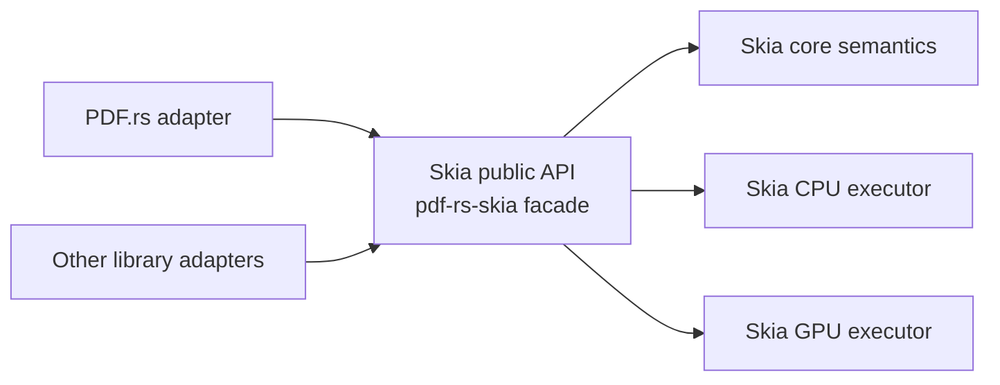

# Skia subsystem boundary

`skia/` is an independently developed 2D graphics subsystem and reusable
library. It owns portable geometry, paths, paints, images, text-glyph drawing
contracts, display lists, and CPU/GPU execution. It is **not** an
implementation detail of PDF.rs and it does not model PDF operators or objects.

## Dependency rule

- `skia/` (`pdf-rs-skia`) is the only public graphics API for consumers.
  `skia/core`, `skia/image`, and executor crates are implementation crates;
  consumers must not depend on them directly. Skia crates may depend on each
  other, but never on a PDF.rs document crate or PDF semantic type.
- The facade exports an explicit, stable set of canvas, geometry, paint, path,
  image, text-outline, and error types. It does not expose display-list
  resource IDs, command representations, or backend command encoders.
- Skia executors depend on `skia/core`; `skia/core` never depends on an
  executor, platform graphics API, PDF parser, document model, or Scene.
- Every consumer, including PDF.rs, calls Skia only through its public API.
  Each consumer owns its source-domain adapter and reports its rendering
  intent, target description, and source data to the Skia upper integration
  layer. That layer owns resource lifetime and executor selection before
  calling lower Skia components.
- A Skia public type, method, error, or command must not mention PDF objects,
  operators, page state, or PDF-specific policy. Add an adapter in PDF.rs when
  such translation is required.

## Geometry and transforms

Paths are immutable geometry resources. `PathBuilder` constructs paths from
generic 2D primitives; it must not encode PDF path or graphics-state rules.
Canvas and display-list transforms are generic affine drawing state that apply
to subsequent drawing operations. They are not PDF `cm` commands. A consumer
that has a source-specific matrix is responsible for mapping it at its adapter
boundary.

Current primitive construction includes rectangles, circles, ellipses, rounded
rectangles, circles, ellipses, rounded rectangles, polygons, deterministic
cardinal arcs, arbitrary-angle and rotated ellipse arcs up to one full turn,
quadratic and rational-quadratic Béziers, and cubic Béziers. Paths can be
transformed, appended, reversed, and queried for both conservative
control-point bounds and curve-extrema-aware conservative bounds (with rational
quadratics retaining their control hull). `DisplayList` and the GPU encoder
expose both transform replacement and affine concatenation as generic
graphics-state operations. Boolean path operations, stroke-to-path expansion,
path effects, and tangent-/endpoint-defined arc variants remain separate
geometry-processing work; their design must stay independent of any consumer.
