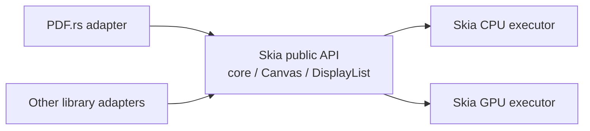

# Skia subsystem boundary

`skia/` is an independently developed 2D graphics subsystem and reusable
library. It owns portable geometry, paths, paints, images, text-glyph drawing
contracts, display lists, and CPU/GPU execution. It is **not** an
implementation detail of PDF.rs and it does not model PDF operators or objects.

## Dependency rule

- `skia/core` defines the reusable public graphics API. It may depend on other
  Skia subsystem crates, but never on a PDF.rs document crate or PDF semantic
  type.
- Skia executors depend on `skia/core`; `skia/core` never depends on an
  executor, platform graphics API, PDF parser, document model, or Scene.
- Every consumer, including PDF.rs, calls Skia only through its public API.
  Each consumer owns its own source-domain adapter and translates its data into
  Skia geometry, resources, and drawing operations before selecting an
  executor.
- A Skia public type, method, error, or command must not mention PDF objects,
  operators, page state, or PDF-specific policy. Add an adapter in PDF.rs when
  such translation is required.

## Geometry and transforms

Paths are immutable geometry resources. `PathBuilder` constructs paths from
generic 2D primitives; it must not encode PDF path or graphics-state rules.
Canvas and display-list transforms are generic affine drawing state that apply
to subsequent drawing operations. They are not PDF `cm` commands. A consumer
that has a source-specific matrix is responsible for mapping it at its adapter
boundary.

Current primitive construction includes rectangles, circles, ellipses, rounded
rectangles, and deterministic cardinal ellipse arcs. Generic arbitrary-angle
arc APIs and path-level transform/bounds operations remain follow-up Skia API
work; their design must stay independent of PDF.rs.
